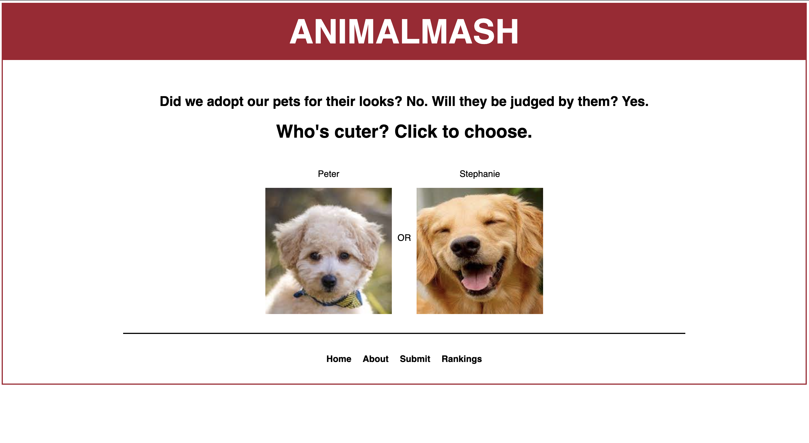
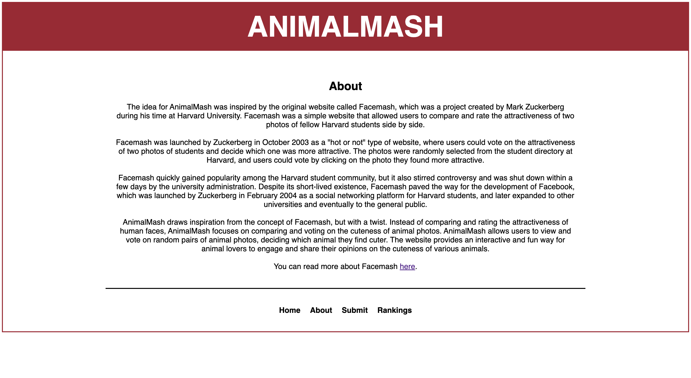
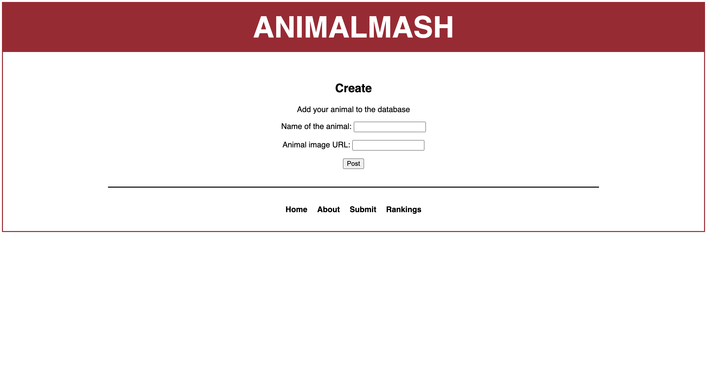
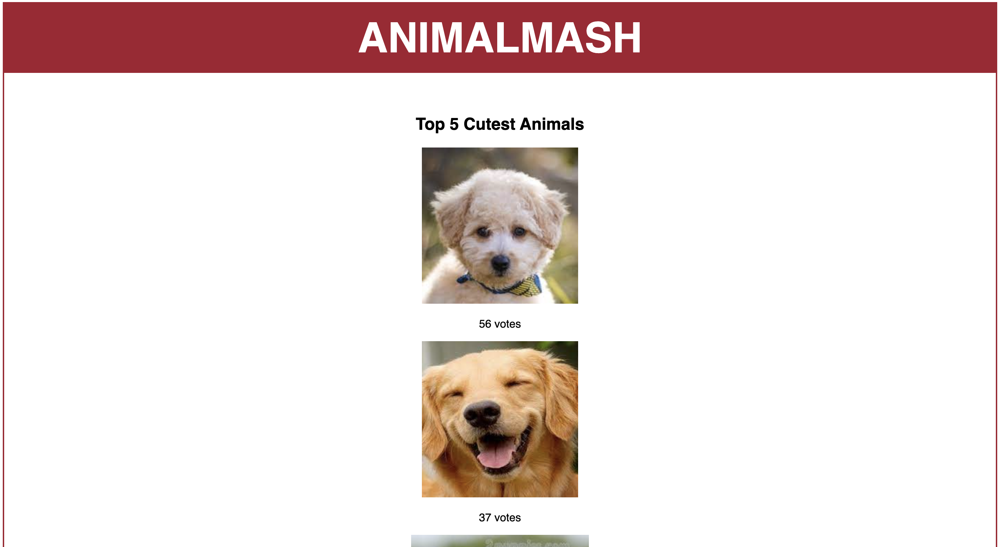

## Animalmash

### Description

_Animalmash_ is a take om Marc Zuckerberg's '06 project _Facemash_ which laid the foundation to his idea of creating Facebook, but instead of having the user select a female student of Harvard University, they are chosing the cutest animal displayed. The CSS was inspired from screenshots taken from movie [The Social Network](https://static.wikia.nocookie.net/thesocialnetwork/images/6/68/Facemash.jpg/revision/latest?cb=20130914200210), as I was unfortunetely unable to use a tool such as [Wayback Machine](https://archive.org/web/) to find the authentic HTML and CSS of the actual website.

Below are some screenshots of the app:

#### Landing Page

#### About Page

#### Upload Page

#### Rankings Page

